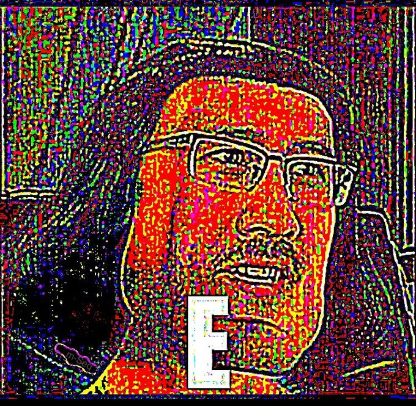

# What is something you are currently frustrated by?

If you've met me in person, you'll know that I've got kind of a strange fascination with the Generation Alpha brainrot vocabulary.
Gen $\alpha$ is entering high school next year, so I think it'd be appropriate if I finally poke through some of my thoughts to figure out how I really feel about this lingo.

I'm frustrated by brainrot words, but not in the way that you think.

For context, I don't have TikTok or Instagram, so I only learned about brainrot through my friends.
Before I knew what it was, I knew that everyone my age hated it.

I don't really have the same reaction as other people when I hear some gen $\alpha$ toddler say "you're so skibidi", so let's figure this whole brainrot thing out.
There's sort of an inherent contradiction in taking brainrot language seriously, right?
It's supposed to be incomprehensible.

For this reason, it's sorta hard to actually pin down what brainrot is. 
The word is a noun, and it's not new.
Previously, brainrot was a word used to describe other forms of media by association, whereas today brainrot refers to a culture itself. 
For example, in the past, people would say things like: 
> "Video games, tv, and comics are brainrot".

In the above quote, brainrot refers to something that, uh, rots your brain.
Contrast this to the meaning of the word today: Brainrot refers to a specific set of trends.
> Previously, brainrot meant "media that rots your brain".
> Now, brainrot means "skibidi toilet" and associated words.
> It no longer just signifies "a thing that rots your brain", it refers to a specific vocabulary.

When I talk about brainrot nowadays, iPad kids and sigma edits populate your noggin.
Current day brainrot is an amalgamation of words, phrases, and media associated with the youngest among us ඞ.
Not all the gen $\alpha$-s are equally involved in this culture, but there is a vernacular and milleu that is generationally distinct, and this is what I'm curious about.

We call this language "Brainrot", but what is brainrot really? Let's make a list of some brainrot or brainrot-adjacent terms.

> Skbidi, Sigma, Ohio, Rizz, Baby Gronk, Fanum Tax, Kai Cenat, Mewing, IShowSpeed, Looksmaxxing, Mogging

The definitions for the above are diverse, but each is vaguely related to some sort of internet meme or personality to come around in the past couple of years. 
Several terms (Fanum Tax, Kai Cenat, IShowSpeed) are names of or related to popular streamers, and several other terms (Sigma, Mewing, Looksmaxxing, Mogging) are from incel-adjacent cesspit forums.

But really the only way that they're *all* related is that they've been incorporated into the gen $\alpha$ lingo.

So what do all of these words actually mean? Well, it's complicated. 
Rizz was originally slang for charisma, but now it can act as a verb, too.
You can "rizz someone up", but you can't "charisma someone up".
Sigma was originally an alternative to an "Alpha Male" and deserves a whole breakdown of its own.

But most of these words don't really mean anything at all.

When a kid exclaims "What the Skibidi!" they aren't referring to Skibidi Toilet.
I think that skibidi in this context acts like an expletive.
It's meaningless in the same way that "H-E-Double-Hockeysticks" or other your other favorite four letter words are meaningless when used in this manner. 

> Consider the phrase: What the heck?
>
> Heck doesn't really have a meaning in this context. What is a heck? Even if we were to replace heck with its no-no word counterpart, h*ll doesn't really mean anything in that context either. It certainly isn't referring to the land of the damned.
>
> While "Damn it!" might denotatively be the same as "Condemn it", the person who says "Damn it!" is not trying to condemn something at all, but instead expressing frustration.
> This need would be similarly served by saying something like "Dang!" or "Rats!", even though these have different denotative meanings. 

Expletive words have meanings in the same way that brainrot words do.
We all know what "crap" is, even if expressing "Crap!" is more about discontent than manure.
Similarly, we know what a "sigma" is, even if "What the Sigma!" is more about conveying suprise than the fact that someone is a ~~lone wolf~~ loser.
(Also, it's worth noting that some brainrot words are exempt from this, although they seem to be the exceptions that prove the rule. 
For example, people generally use "mewing" and "mogging" in ways coherent with their definitions).

But the thing that sets brainrot words apart is that they can eschew their meanings even when they aren't used in an expletive context. 
In fact, I'd wager that most of the time these words are used, they're used in this capacity.
I'm not the first person to point out that the lyrics of [The Fanum Tax Song](https://www.tiktok.com/@ovp.9/video/7285477963217325342) don't exactly make sense.

> You're so skibidi
>
> You're so fanum tax
>
> I just wanna be your sigma
>
> Freaking come here
>
> Gimme your Ohio

In the above, "You're so fanum tax" is a meaningless statement, even though it's not expletive or used to express discontent. 
Brainrot words are unique in that they can be meaningless in normal conversation, too, not just in outbursts.
Whereas crap necessarily has a meaning for as long as it's not used in an outburst (For example, it keeps its meaning in the metaphor "full of crap"), Ohio is not the same way.
Brainrot words are empty words, remarkable insofar as they have the ability to say nothing. 
They're not offensive, they're not evocative, they're not anything really.

---

 <i>The Treachery of Skibidi</i> (See <a href="https://www.renemagritte.org/the-treachery-of-images.jsp">original</a>)

---

You'd be forgiven for thinking that, due to my above treatise (lol), I believe that people are frustrated by brainrot because the words are empty. 
Like the fact that they are so meaningless is an intellectual insult.

But really, I think that the gen Z frustration with brainrot is just another manifestation of "kids these days". 
The fact that brainrot words are meaningless is incidental to Gen Z's distaste for the lingo.
I'm not the first to point out that Gen Z has produced many meaningless jokes of our own.

Even the king of brainrot, Skibidi Toilet, is just the next generation of Gen Z's Source Filmmaker memes.

I've asked probably 20 people at this point, and I have yet to find an actual reason why I should dislike the gen $\alpha$ lexicon. 
This is what really frustrates me about brainrot.

Are we really falling for that stupid inter-generational drama again?

Brainrot isn't called what it is because gen $\alpha$ thinks it's brainrot, it's called that because gen Z thinks it's brainrot.
Brainrot isn't even an inappropriate name, considering how empty the words are, but it's not like we apply that standard to our own memes.
For example, several of the terms we now consider brainrot (Sigma, Looksmaxxing, Mewing) have been in play for the last several years in language, but we didn't start calling them brainrot until they became associated with gen $\alpha$.

I know that I'm probably taking all of this brainrot business too seriously, but I really think that the committed brainrot haters don't actually understand why it is that they hate brainrot so much.
I understand the visceral reaction to watching your local iPad kid scroll through Skibidi Toilet TikToks all day.
But I can't justify why I feel that reaction!
When I set out to write the beginning of this post about the meaninglessness of brainrot, I thought that I would discover the reason that brainrot words are public enemy #1.

But I didn't: I found a quirk of the language is all.
That's not the reason everyone hates brainrot!
I tell people that "brainrot words are the purest simulacras" and their eyes glaze over.

Permit me to be dramatic: When we give in to the brainrot hatred, we are being ruled by our base instints.
Compose yourself! Get a grip! EMBRACE THE SKIBIDI.

The kids are alright y'all, I promise.
We were the same way (and we are totally awesome now).

Brainrot words are kinda funny, and Skibidi Toilet is a creative webseries.
Maybe I'll write more about this later, but not now.
But while we've got our collective 42 layers of irony on, indulge in one and have a laugh at some brainrot with me.

Who knows. The next book on my list is *Ecstasy of Communication* by Baudrillard. So maybe I'll read that decide that this whole debacle about meaningless words was pointless anyways.