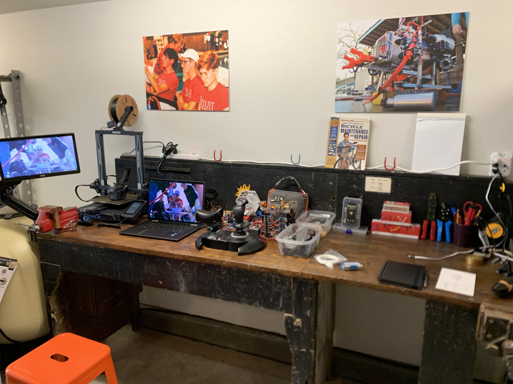
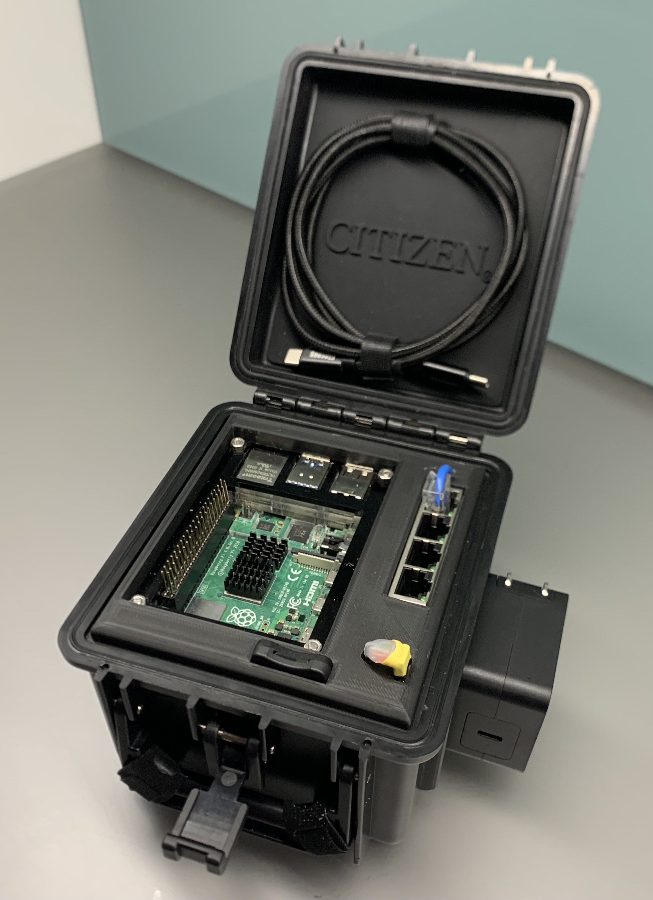
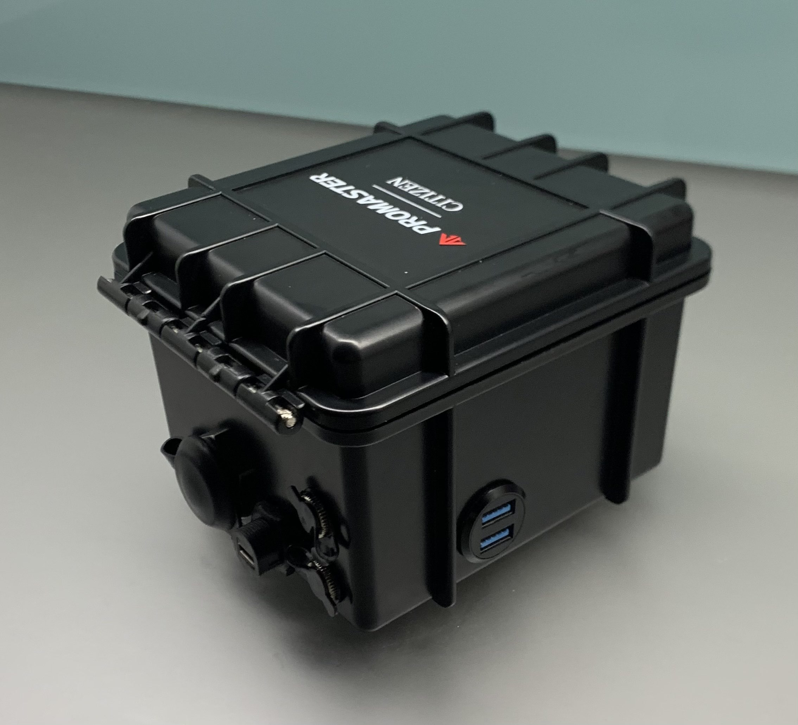

# Picture the one person in the world you really wish were reading your blog. Write her or him a letter.
Hi Grandpa,

I haven't spoken to you in over three years. 
A lot has changed about me since then, and I have some things to say to you that I never told you in person.
So I guess I'll just get started.

After you died, grandma gave some of your things to mom and I.
Remember the workbench that you made, the one where you replaced a leg with a broken door?
We set it up in the garage and I moved in. Here's a photo.

 Your workbench in action 

I probably use it for very different things than you're used to.
All of our saws and drills and stuff are still in the shed out back, so I don't actually use the bench for any woodshop.
But I keep it pretty clean (when I'm not actively using it), and I work there all the time for personal electronics projects.
When I took the above photo a couple of months ago, I set up some of the test hardware I built for my robotics team.
You can't see much of it because the photo is so zoomed out and blurry, but that big throttle and stick unit is what I use to control it.

I've tried not to modify the bench too much, to keep it close to what you would've wanted.
I took the liberty of drilling some holes in the back pane to route some cables, and obviously I have that monitor desk mount, which doesn't really seem like your style.
But I figured you'd be okay with that.
As an aside, I got that tiny monitor for free from a local middle school which didn't need it anymore.
It's a piece of junk, but it works and monitors aint cheap.
I also may move that vice a couple inches to the right, because sometimes it interferes with the bed of my 3D printer.

Speaking of, I got that 3D printer as a holiday present this past december.
Grandma came over (oh yeah - she lives close by now, more on that later), and I gave her a little tour of everything on the workbench while I assembled the printer.
I'm not sure how much of it stuck with her.
You know that tech has never been her thing, but I think she understands what a soldering iron is now.
And we had a nice moment appreciating the new life that this workbench lives.
She teared up a little bit and said that "Glynn would've loved to see this".
I've thought about that a lot, and that's why I'm writing you this letter.

I've noticed that ever since you died, I've taken after you in a couple of ways.
I think I'm similarly tinker-y.
You were always fixing or building something, and I've picked that up from you.
Here's the most recent fruit of the workbench:

 Portable Server 

It's a portable server.
It seems like I build something with similar specs to this project every time I make a new robot.
So I figured I would make a permanent solution, instead of having to buy more Raspberry Pis and buck converters for each bot I build.
It's not the most complex project I've ever done, and it's certainly not much compared to what some of the people at MIT create.
But it survived the TSA stress test when I put it in my luggage, and I am pleased with how durable it has been.
I accomplished my goal in that regard.
The case is the star of the show, really.
It's a container for a fancy dive watch that my then girlfriend got me a few months ago.
The watch was pricey and I felt bad accepting it, but my girlfriend wasn't hearing it.
So I figured that (to use a metaphor I detest) I might as well use the whole animal.

Maybe I'm giving myself too much credit, but I thought it was cosmically appropriate that I build something like this on your bench with legs made out of broken doors.

The case is IP67 waterproof (can be submerged temporarily) per the testing that I did in my friend's pool (I strapped it to a dumbbell and sunk it for two hours).
All of the panel mounts I installed are also rated to withstand immersion in water, so theoretically it should be waterproof with all the barrel plugs and USB ports on the side covered. 
But now it's full of electronics so I'm not brave (stupid) enough to test it.
Either way, for my applications, I really only need IP65 waterproofing (which means it can get sprayed with water and still be fine).

 Backside of the portable server (USB A and USB C covers not pictured) 
 

While we're on the subject of tinkering, last night I taught myself how to sew to fix Alexa's backpack.
She's getting a new bag next year because the current one doesn't fit her highschool textbooks, and it has a strap for securing water bottles that broke.
I fixed the strap, and I'm taking that bag with me to MIT this fall.
I don't want to let it go to waste, which is an instinct I'm sure you'd appreciate.
It's a small fix, but now I think about you whenever I see that backpack.

After you died, grandma moved to a retirement home about 10 minutes from Stanford, and about 2.5 hours from our house.
It's great to be able to see her more often.
When I got into Stanford REA, I didn't even entertain the possibility of getting into MIT.
So I thought that I'd be seeing her on an almost weekly basis, which was exciting.
But I think I understand why you were always so hesitant to leave New York - I see the appeal of east coast cities (especially Boston).
I can walk places. I can bike places. I can take the T.

It is ironic, though, that now that we've finally moved almost our whole family out to the west coast, I'm going to MIT, right where great aunt Mimi lives.
When I was deciding between Stanford and MIT, it's like I was deciding between living next to grandma, or living next to Mimi.
Mom and dad definitely don't see the east coast appeal that I do.
Maybe it's because they're both born east coasters.
But so are you, so who knows.

Also, I just wanted to add one more thing before I wrap this letter up.
I am acquiescing to your "I-told-you-so" about Firefox.
You were right to use it over Chrome.
I'm getting sick and tired of Google owning all of my data, and it seems like you've had your head on straight ever since you were a beta tester.
Also, I've gotten really into linux over the last couple of years.
Maybe one of these days I'll write a blog post about some of my linux endeavors, but not today.
I recall that you asked me a couple of questions about linux when I built my computer back in middle school.
I was dismissive of it back then, but I really wish now that I could talk to you about it.
I'm curious about what you have to say.

Anyways, as I get older I notice that I am becoming more and more like you.
That makes me happy.
I've got more to say to you, but this letter is getting long enough as is and I know that you hate reading emails.
I guess a blog is kind of like an email.
Maybe I'll write you more in the future.

I wish we could've talked more.

 I miss you, 

 James 
