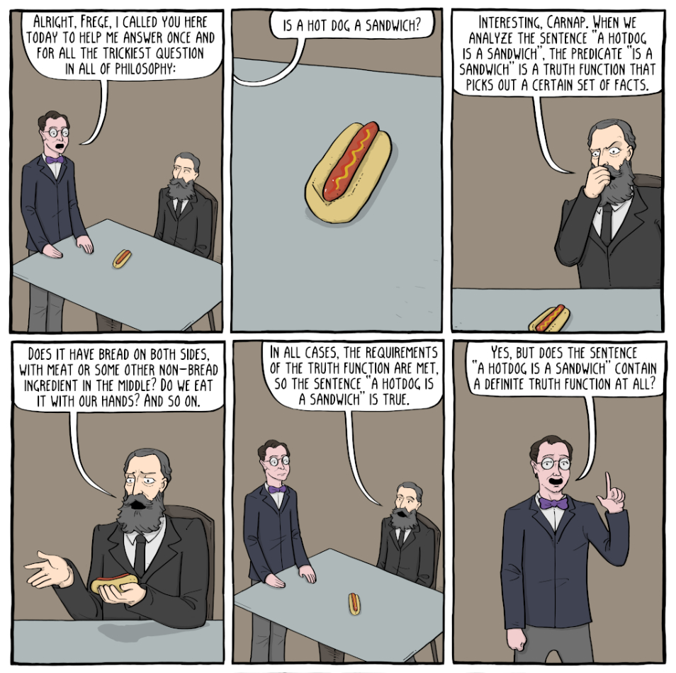

# What is something totally inconsequential that you have a strong opinion about?

**Is a hotdog a sandwich?**

This is a stupid question.
I'm sure that you've heard it before.
You know that it's a stupid question.
It's the platonic, final form, endgame stupid question.
First I'm going to break it down a little bit.

The sandwich conundrum is a rhetorical party trick - it's amusing and it gets the conversation going, and it's probably more fun when you're drunk.
Like a good party trick, the question takes something mundane and adds a quirky flair.

> Tennis balls? Juggling. Deck of cards? Magic tricks.
> Hotdog? Sandwich. Sandwich? Sandwich -

It's a conversation starter, partly because it's a low stakes subject, partly because it's unintuitive, partly because it's so approachable, and partly because it's got a silly memetic quality.
It's a nexus of good conversation centerpiece characteristics.
The question is funny.
The act of answering the question is funny.
Thinking so much about such a stupid question is funny.
It lets the contrarians can play villain-of-the-week, and you get to know new people by forming pro or anti-sandwich alliances with them.

Because the answer to the question is RIGHT THERE - your interlocutors just can't see it.
The obviously correct answer is hauntingly close.
It's taunting you, like you've already said it, and the truth is just jumbled up in a bunch of your words.
Hurry! Untangle it! Before you lose the floor!
But the high octane banter is too blunt an instrument to really determine the meaning.
It's like trying to scratch an itch with your knuckles instead of your nails.
And that perpetual dissatisfaction is what keeps the conversation motivated.

For my money, a hotdog isn't a sandwich.
Later Wittgenstein is one of my favorite philosophers, and his philosophy provides a pretty good answer to this question, summarized in this comic:

 

 Read the rest of this comic <a href="https://existentialcomics.com/comic/268">here</a>

(Existential Comics always releases bangers, you should check them out if you're into philosophy. 
<a href="https://existentialcomics.com/comic/275">Here's</a> another (unrelated) banger about Wittgenstein.)

I have yet to be defeated in a hotdog sandwich conversation when I bring out the later Wittgeinstein. 
Often we'll veer off into tangentially related topics like the discussing social construction of definitions or contesting whether the dictionary is prescriptive or descriptive, and neglect the original question of sandwichery.

But if I were to spend this post defending the anti-sandwich position, I'd be getting lost in the sauce. I do feel strongly about the anti-sandwich position, but it's not really why I wrote this.

Here's the memo: If you have a solution to the sandwich conundrum that you feel is bulletproof, you should probably put it in the backseat.

Because it's such a stupid question, it's understandable to want to slam-dunk your answer through the conversation, like Wittgenstein did in the comic above.
But the sandwich conundrum differs from a normal debate because the goal is not *really* to arrive at the correct conclusion.
It's goofy small talk (and that's good actually).
The conversation is the end in itself, not the answer.

I originally set out to write this post about how a hotdog was definitively not a sandwich. 
I was going to settle the interminable question. 
Because this post is about caring for inconsequential things, and what's more inconsequential than that?

But as I wrote that post, I realized that it really wasn't as pointless as I thought.
>"Damnit! There's too much of a point to my writing!"

The sandwich conundrum has an aesthetic of uselessness - who cares if a hotdog is a sandwich?
But there really is a bit of ingenious purpose to that question - it's a useful meme (in both senses of the word) that has stuck around for a reason.

Consider all of the interesting tangents that can spawn from this conversation.
Don't deprive yourself or the group of those tangents in an effort to actually answer the question itself.
The question is stupid, forget about it. 
Having the technically correct answer obliterates those possibilties.
Embrace your sandwich ignorance.
Consider all of the bouts of hysterical laughter. 
Consider the satisfying frustration of debating in circles. 
Consider the new alliances formed in the conversation, and the bonds strengthened.
The answer to the sandwich conundrum has never *really* been a yes or no.

The answer is *actually* the friends you made along the way : )